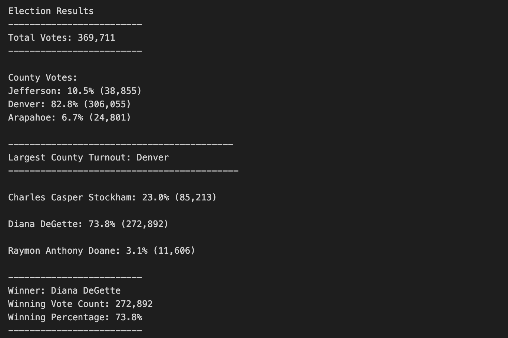

# Colorado BOE Congressional Election Analysis

## Overview of Election Audit
This project provides an analysis of a recent congressional election requested by the Colorado Board of Elections. The results of this analysis completes the audit for the election.

Election data comes from 3 primary methods:
1. Mail-In Ballots
2. Punch Cards
3. Direct Recording Electronic or DRE counting machines

Once the data is collected in the proper format it can be read by this program to provide an analysis of 
other elections as well.  

For this analysis, the total number of votes cast, the counties included in the election, the percentage of votes cast for each county, the winner of the election among other useful information described in detail in the results section of this report.

## Election Audit Results

The image above  shows the output after running the analysis on the last election. Note the following information:
- The total number of ballots that were cast for every county in the congressional district was 369,711 for this particular election.
- Jefferson and Arapahoe counties only made up 10.5 and 6.7 percent of the total votes respectively.  
- The county with the largest turn out was Denver with over 82% of the votes.
- The report also shows results for each candidate with Stockham receiving 23% or 85,213 votes, DeGette receiving 73.8% or 272,892 votes and  Doane only receiving 3.1% or 11,606 of the total votes cast.
- Out of all the candidates, Diana DeGette came out the clear winner with 272,892 votes for nearly 74% of all ballots cast.

## Election Audit Summary
Overall, we can see that Denver has as huge influence in determining which way this particular district will vote. However, the data does not really give enough insight on why this is the case.

Some possible modifications and additions may be helpful:
- What is the party affiliation of each candidate? Though it may not be needed for a congressional election audit, this information may be necessary for a primary election audit.
- For example, does Denver have a higher percentage of voters that are affiliated with the same party as the winner or does it happen to have over 80% of the total number of possible voters anyway?
- Even though we can see the percentage of total votes that each candidate received we don't know the percent in each county. It is possible that the person with the lowest number of votes received most of the votes in the county with the lowest voter count?  This particular voter count may be a high percentage of the county if it happens to be more rural, for example.

From a software maintenance perspective, refactoring the code is most likely necessary.
- To ensure this program will work for any election the data included may be in a different format.
- It is highly likely that some records will have missing data or incorrect data.
- An error log would be useful for records that were incomplete or that could not be read for some reason. This data could be included as part of the analysis as well.
- Knowing which system the data came from could be useful for tracing records that had issues. For example, do punch ballots have a lot more mistakes than ones from electronic machines?
